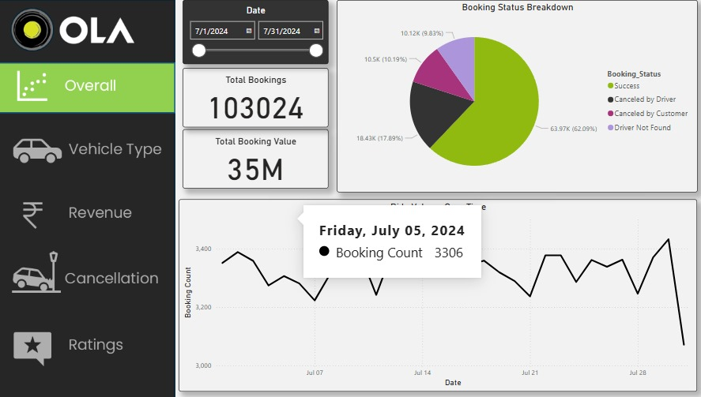
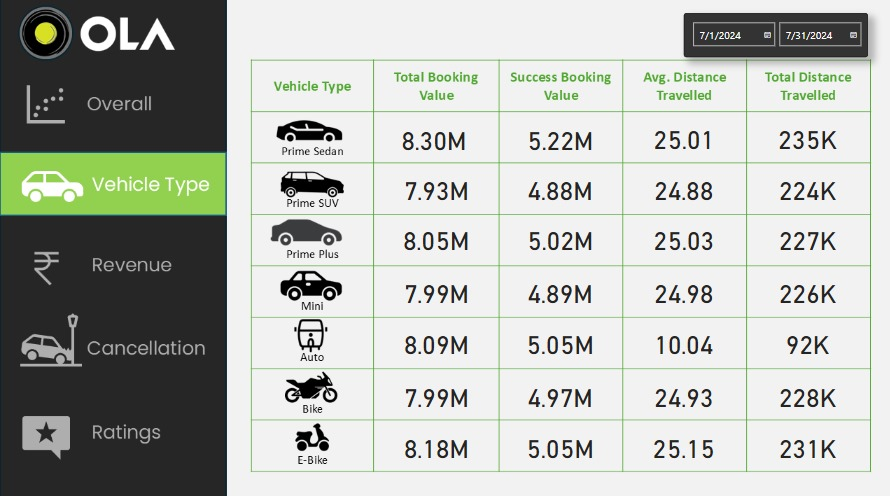
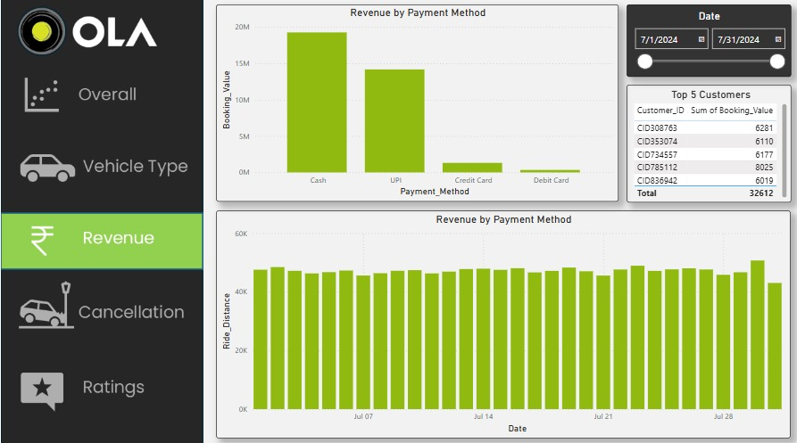
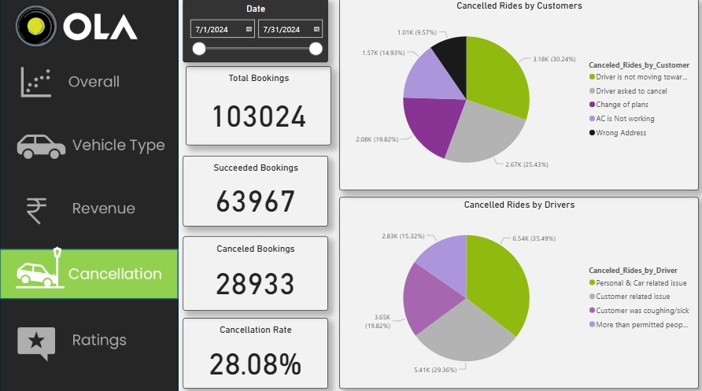
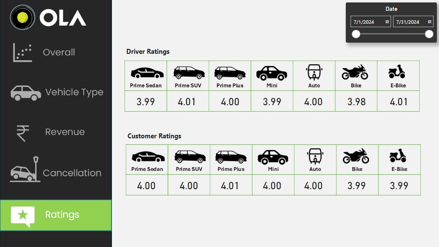

# OLA Ride-Sharing Data Analysis Project

## Overview
A comprehensive analysis of OLA's ride-sharing service data for July 2024, focusing on booking patterns, revenue metrics, vehicle performance, and customer satisfaction. The project utilizes SQL for data analysis and Power BI for visualization.

## Dashboard Insights

### 1. Overall Performance Metrics

- **Total Bookings**: 103,024
- **Total Booking Value**: 35M
- **Daily Booking Pattern**: Average of ~3,300 bookings per day with notable fluctuations
- **Booking Status Distribution**:
  - Success: 62.09%
  - Driver Not Found: 17.89%
  - Cancelled by Customer: 10.15%
  - Others: 9.87%

### 2. Vehicle Type Analysis

| Vehicle Type | Total Booking Value | Success Value | Avg. Distance | Total Distance |
|-------------|-------------------|---------------|---------------|----------------|
| Prime Sedan | 8.30M | 5.22M | 25.01 km | 235K km |
| Prime SUV | 7.93M | 4.88M | 24.88 km | 224K km |
| Prime Plus | 8.05M | 5.02M | 25.03 km | 227K km |
| Mini | 7.99M | 4.89M | 24.98 km | 226K km |
| Auto | 8.09M | 5.05M | 10.04 km | 92K km |
| Bike | 7.99M | 4.97M | 24.93 km | 228K km |
| E-Bike | 8.18M | 5.05M | 25.15 km | 231K km |

### 3. Revenue Analysis

#### Payment Method Distribution
- Cash: Highest share (~20M)
- UPI: Second highest (~15M)
- Credit Card: Third position (~2M)
- Debit Card: Lowest share (~0.5M)

#### Top 5 Customers by Booking Value
1. CID308763: 6,281
2. CID358074: 6,110
3. CID734557: 6,177
4. CID785112: 8,025
5. CID836942: 6,019
Total: 32,612

### 4. Cancellation Analysis

- **Overall Cancellation Rate**: 28.08%
- **Total Cancelled Bookings**: 28,933
- **Successful Bookings**: 63,967

#### Customer Cancellation Reasons
- Driver not moving forward: 30.24%
- Driver asked to cancel: 25.43%
- Change of plans: 19.82%
- AC not working: 14.93%
- Wrong Address: 9.57%

#### Driver Cancellation Reasons
- Personal & Car related issues: 35.49%
- Customer related issues: 29.26%
- Customer was coughing/sick: 20.32%
- More than permitted people: 14.92%

### 5. Rating Analysis

#### Driver Ratings
- Highest: Prime SUV & E-Bike (4.01)
- Lowest: Bike (3.98)
- Most vehicles maintain ratings between 3.99-4.01

#### Customer Ratings
- Highest: Prime Plus (4.01)
- Lowest: Bike & E-Bike (3.99)
- Consistent ratings across vehicle types

## SQL Queries Used

### 1. Successful Bookings Analysis
```sql
SELECT * FROM bookings 
WHERE Booking_Status = 'Success';
```

### 2. Vehicle Distance Analysis
```sql
SELECT Vehicle_Type, AVG(Ride_Distance) as avg_distance 
FROM bookings 
GROUP BY Vehicle_Type;
```

[Additional SQL queries as provided in our original list...]

## Technical Stack
- Database: SQL Server
- Visualization: Power BI Desktop
- Data Processing: SQL
- Version Control: Git

## Key Features
1. Interactive date range selection (July 1-31, 2024)
2. Multi-dimensional booking analysis
3. Comprehensive vehicle performance metrics
4. Detailed payment and revenue tracking
5. Customer and driver rating comparison

## Future Enhancements
1. Real-time booking tracking
2. Geographical heat mapping
3. Predictive cancellation analysis
4. Customer segmentation
5. Advanced revenue forecasting

## Author
 (https://github.com/ankit4533)
 
